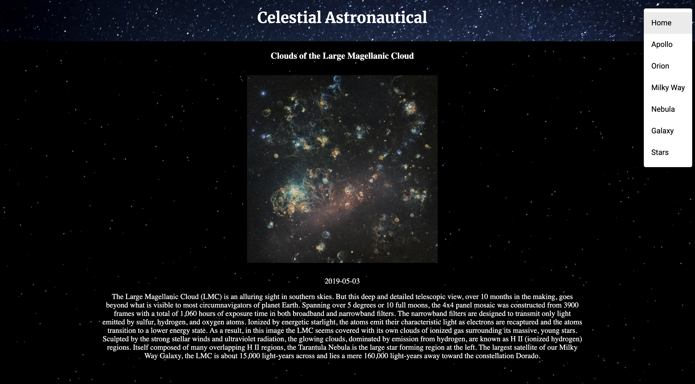
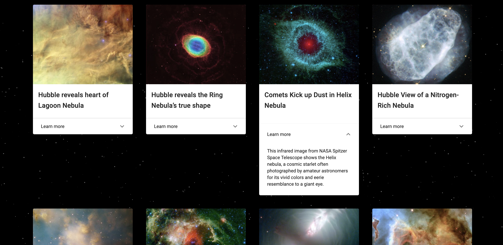

## Celestial Astronautics

### Author
Isaac Sunoo

## Getting Started:
These instructions will get a copy of the project up and running on your local machine for usage and testing purposes.

Get NASA API Key froom https://api.nasa.gov/index.html#apply-for-an-api-key

clone down the repository:
```
$ git clone https://github.com/IsaacSunoo/celestial-astronautics.git
```
Inside of src folder, create an 'api_key' folder, inside folder create api.js file.
```
const apiKey = 'insert api key here';

export default apiKey;
```
cd into directory and run npm install:
```
$ npm install
```

launch in your browser:
```
$ npm start
```

### Description:

Are you interested in the cosmos?  Here you can see the most recent photos from NASA dealing with a plethora of galactic interests.

### Stretch Goals and Unimplemented Features:

Stretch goals would include building out more data in a more stylish UI.  Another goal would be to create an interactive game to test the knowledge of the user.

## Project Tools:
* HTML
* JavaScript
* React / Redux
* Thunks
* CSS
* Sass

## Screenshots
Main Page


Example Results


Info Dropdown

